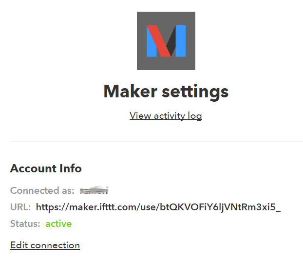

Send-to-IFTTT
=============

This is a chrome extension that sends the current URL to IFTTT for
further processing through the "Maker Channel".

After installing the extension you will need to:

1. Activate the Maker service on IFTTT
2. Configure the Maker channel key in the extension using the "Options" menu.
3. Create an IFTTT that handles the incoming URLs and titles, e.g. by
    storing them in Pocket or Reading List or a Google Docs spreadsheet etc.

Activating the Maker service
----------------------------
> 

To activate the Maker service follow these steps:

 1. Find the ["Maker" service](https://ifttt.com/maker) on IFTTT and click
  on "Connect"
 2. Click on "Settings" in the upper right hand corner.
 3. The weird group of letters at the end of the URL (btQKVoFiY6ljVNtRm3xi5_
 in this example)is your **key**

Configuring the extension
-------------------------

Go to the Extensions menu in chrome. Select the "Options" link for the
extension. Input your key and press "Save".

Creating your first applet
--------------------------

When the extension is triggered, the current page URL and title will be sent
to IFTTT. You can then create an IFTTT recipe to do something useful with it.
We will make an applet that adds the current page to the iOS Reading
List.

 1. Create an applet. Select the "Maker" service as "this".
 2. Enter "got_interesting_url" as event name, or your custom event name if
 you configured a different one. Press "Create trigger".
 3. Select the "iOS Reading List" service as "that", and select "Add item to
 Reading List".
 4. Select "Value1" as URL and "Value2" as title. Select "Create action".
 5. Finish!

